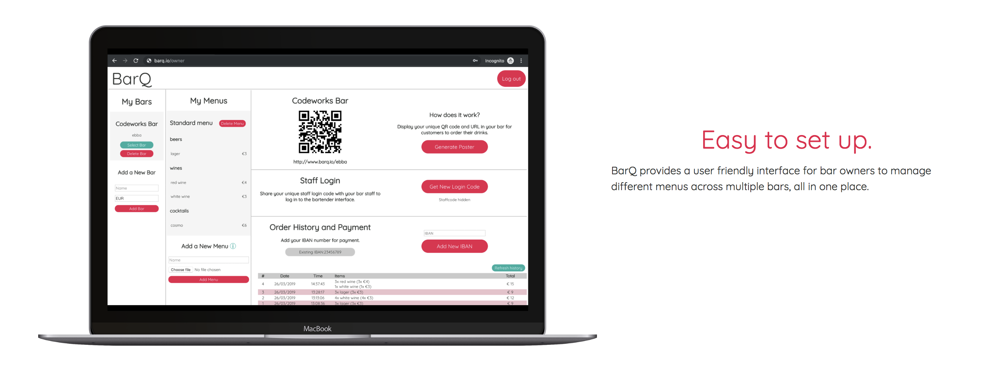
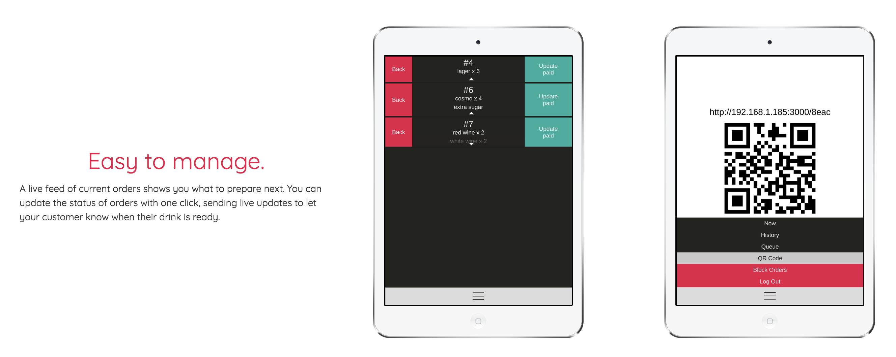

# BarQ
*Streamlined order and payments management for bars and pubs*

BarQ allows you to order and pay for drinks from your phone wherever you are in the bar. No more fighting through crowds and waiting to catch a bartenders' attention. Browse the menu and place your order without leaving your seat. You’ll be notified as soon as your order is ready to pick up.

## Getting Started
Each of the interfaces (Customer, Staff, and Admin) is a separate React app and expects to connect with the [BarQ Server](https://github.com/felixweinberger/barq-server).

1. Clone this repo and the [BarQ client](https://github.com/felixweinberger/barq-client) where you want them (e.g. `~/projects/barq`)
2. Rename the `.env.example` file to `.env` and fill in necessary fields
3. Double check that the BarQ server directory is named `barq-server` (this is to ensure that the front-end finds the correct docker network)
4. In `/barq-server`, run `docker-compose build`
5. In `/barq-server`, run `docker-compose up`
6. Run BarQ client with `docker-compose` (check the [BarQ client repository](https://github.com/felixweinberger/barq-server) for further details).

## Tech Stack
### Customer
- React
- Redux
- Axios
- Socket.io-client

### Staff
- React
- Redux
- Axios
- Socket.io-client

### Admin
- React
- Materialize

### Server
- Node.js
- Express
- MongoDB
- Socket.io-server

## Contributors
- Natalia Rizzi
- Egill Hreinsson
- Alan Hu
- Felix Weinberger
- Rachel Bonny
